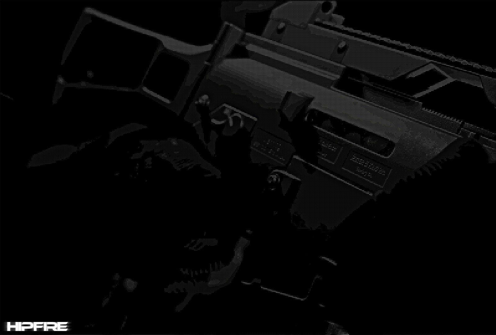

<p align="center">
  
</p>

<h1 align="center">HIPFIRE ENGINE</h1>
<p align="center"><em>A lightweight, worldmodel‑based Roblox FE gun engine</em></p>

---

## ✨ Features

### 🎯 Worldmodel-Based Gun System

* No viewmodel trickery
* Your character sees the actual weapon model in their hands
* More immersive and cleaner for stylized or realistic games

### ⚙️ Fully FE-Compatible

* 100% FilteringEnabled-safe
* Properly replicated effects
* Works across all network ownership setups

### 🩸 Optional Effects & Gameplay Systems

* Ragdoll support
* Blood and hit effects
* Damage callbacks + modular hit detection
* Configurable recoil, sway, animations, and interactions

### 🔧 Highly Configurable

A broad set of tweakable settings covering:

* Weapon Animations
* Visual effects
* Sound effects
* Models
* ETC

### 🚀 Live Hotfixes & Patch Support

Built to receive:

* Bug fixes
* Stability patches
* Minor feature updates

---

## 📦 Installation

1. Download the latest release from this repo page
2. Insert the engine folder/module into your game
3. Adjust settings in the configuration module
4. Hook your weapons into the engine (sample guns included)

---

## 📝 Usage Requirements

HIPFIRE ENGINE is free to use, modify, and integrate — but requires attribution.

**You must either credit:**

```
HIPFIRE ENGINE by NoX
```
Or
```
https://github.com/NoXDev-rblx/HIPFIRE-ENGINE
```

**You may not:**

* Remove credit
* Claim the engine as your own
* Redistribute without attribution

---

## 📚 Docs & Examples

Documentation, examples, and setup guides will be added soon. Check the `examples/` folder for sample weapons soon.

---

## ❤️ Contributing

Pull requests, bug reports, and improvements are welcome! Fork the project and submit patches.

---

## 🛠️ Planned Future Features

* More gun features
* Weapon attachment system
* AI integration hooks
* In-game debugging console
* Modular damage types

---

## 📄 License

Uses the **MIT License**.
